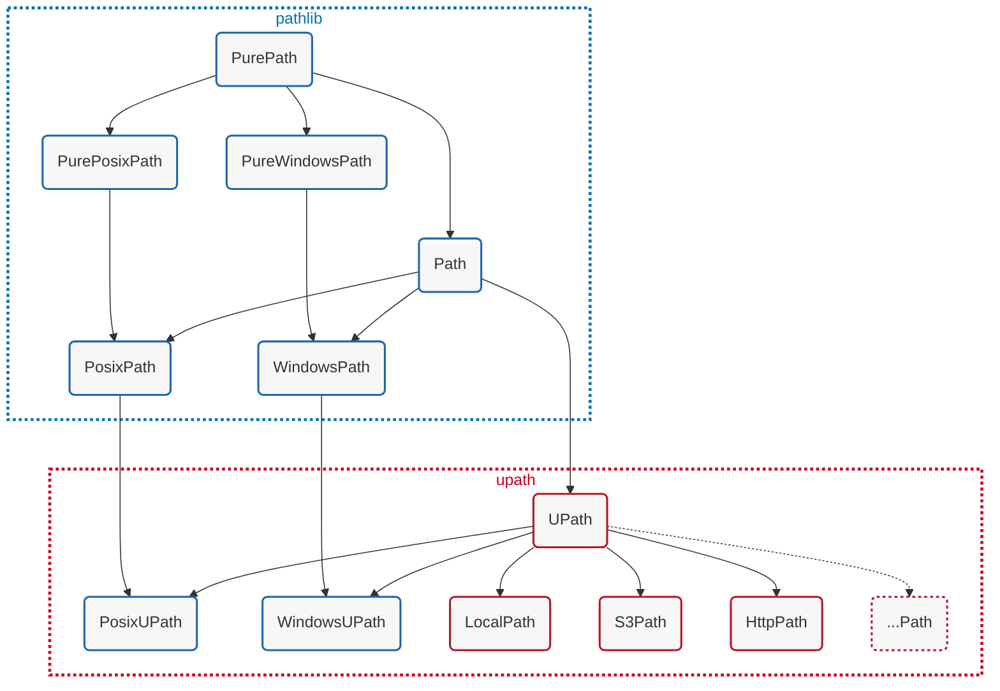

# Universal Pathlib

[](https://pypi.org/project/universal_pathlib/)
[](https://pypi.org/project/universal_pathlib/)
[](https://github.com/fsspec/universal_pathlib/blob/main/LICENSE)
[](https://anaconda.org/conda-forge/universal_pathlib)

[](https://github.com/fsspec/universal_pathlib/actions/workflows/tests.yml)
[](https://github.com/fsspec/universal_pathlib/issues)
[](https://github.com/psf/black)
[](./CHANGELOG.md)

Universal Pathlib is a python library that aims to extend Python's built-in [`pathlib.Path`](https://docs.python.org/3/library/pathlib.html) api to use a variety of backend filesystems using [`fsspec`](https://filesystem-spec.readthedocs.io/en/latest/intro.html)

## Installation

### Pypi

```bash
python -m pip install universal_pathlib
```

### conda

```bash
conda install -c conda-forge universal_pathlib
```

## Basic Usage

```pycon
# pip install universal_pathlib s3fs
>>> from upath import UPath
>>>
>>> s3path = UPath("s3://test_bucket") / "example.txt"
>>> s3path.name
example.txt
>>> s3path.stem
example
>>> s3path.suffix
.txt
>>> s3path.exists()
True
>>> s3path.read_text()
'Hello World'
```

For more examples, see the [example notebook here](notebooks/examples.ipynb)

### Currently supported filesystems (and schemes)

- `file:` Local filessystem
- `memory:` Ephemeral filesystem in RAM
- `az:`, `adl:`, `abfs:` and `abfss:` Azure Storage (requires `adlfs` to be installed)
- `http:` and `https:` HTTP(S)-based filesystem
- `hdfs:` Hadoop distributed filesystem
- `gs:` and `gcs:` Google Cloud Storage (requires `gcsfs` to be installed)
- `s3:` and `s3a:` AWS S3 (requires `s3fs` to be installed)
- `webdav+http:` and `webdav+https:` WebDAV-based filesystem on top of HTTP(S) (requires `webdav4[fsspec]` to be installed)

Other fsspec-compatible filesystems may also work, but are not supported and tested.
Contributions for new filesystems are welcome!

### Class hierarchy

The individual `UPath` subclasses relate in the following way with `pathlib` classes:



When instantiating `UPath` the returned instance type depends on the path that was provided to the constructor.
For "URI"-style paths, `UPath` returns a subclass instance corresponding to the supported `fsppec` protocol, defined
by the URI-scheme. If there is no specialized subclass implementation available, `UPath` with return a `UPath` instance
and raise a warning that the protocol is currently not being tested in the test-suite, and correct behavior is not
guaranteed.
If a local path is provided, `UPath` will return a `PosixUPath` or `WindowsUPath` instance.
These two subclasses are 100% compatible with the `PosixPath` and `WindowsPath` classes of their
specific Python version, and are tested against all relevant tests of the CPython pathlib test-suite.

### UPath public class API

`UPath`'s public class interface is identical to `pathlib.Path` with the addition of the following attributes:

- `UPath(...).protocol: str` the filesystem_spec protocol _(note: for `PosixUPath` and `WindowsUPath` it's an empty string)_
- `UPath(...).storage_options: dict[str, Any]` the storage options for instantiating the filesystem_spec class
- `UPath(...).path: str` the filesystem_spec compatible path for use with filesystem instances
- `UPath(...).fs: AbstractFileSystem` convenience attribute to access an instantiated filesystem

the first three provide a public interface to access a file via fsspec as follows:

```python
from upath import UPath
from fsspec import filesystem

p = UPath("s3://bucket/file.txt", anon=True)

fs = filesystem(p.protocol, **p.storage_options)  # equivalent to p.fs
with fs.open(p.path) as f:
    data = f.read()
```

### Register custom UPath implementations

In case you develop a custom UPath implementation, feel free to open an issue to discuss integrating it
in `universal_pathlib`. You can dynamically register your implementation too! Here are your options:

#### Dynamic registration from Python

```python
# for example: mymodule/submodule.py
from upath import UPath
from upath.registry import register_implementation

my_protocol = "myproto"
class MyPath(UPath):
    ...  # your custom implementation

register_implementation(my_protocol, MyPath)
```

#### Registration via entry points

```toml
# pyproject.toml
[project.entry-points."unversal_pathlib.implementations"]
myproto = "my_module.submodule:MyPath"
```

```ini
# setup.cfg
[options.entry_points]
universal_pathlib.implementations =
    myproto = my_module.submodule:MyPath
```

## Contributing

Contributions are very welcome.
To learn more, see the [Contributor Guide](CONTRIBUTING.rst).

## License

Distributed under the terms of the [MIT license](LICENSE),
*universal_pathlib* is free and open source software.

## Issues

If you encounter any problems,
please [file an issue](https://github.com/fsspec/universal_pathlib/issues) along with a detailed description.
