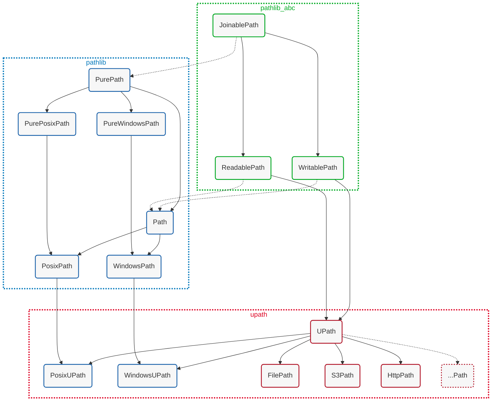

# Universal Pathlib

[](https://pypi.org/project/universal_pathlib/)
[](https://pypi.org/project/universal_pathlib/)
[](https://github.com/fsspec/universal_pathlib/blob/main/LICENSE)
[](https://anaconda.org/conda-forge/universal_pathlib)

[](https://github.com/fsspec/universal_pathlib/actions/workflows/tests.yml)
[](https://github.com/fsspec/universal_pathlib/issues)
[](https://github.com/psf/black)
[](./CHANGELOG.md)

Universal Pathlib is a Python library that extends the
[`pathlib_abc.JoinablePath`][pathlib_abc] API to provide a
[`pathlib.Path`][pathlib]-like interface for a variety of backend filesystems
via [`filesystem_spec`][fsspec].

[pathlib_abc]: https://github.com/barneygale/pathlib-abc
[pathlib]: https://docs.python.org/3/library/pathlib.html
[fsspec]: https://filesystem-spec.readthedocs.io/en/latest/intro.html


## Installation

Install the latest version of `universal_pathlib` with pip or conda. Please note
that while this will install `fsspec` as a dependency, for some filesystems, you
have to install additional packages. For example, to use S3, you need to install
`s3fs`, or better depend on `fsspec[s3]`:

### PyPI

```bash
python -m pip install universal_pathlib
```

### conda

```bash
conda install -c conda-forge universal_pathlib
```

### Adding universal_pathlib to your project

Below is a `pyproject.toml` based example for adding `universal_pathlib` to your
project as a dependency if you want to use it with `s3` and `http` filesystems:

```toml
[project]
name = "myproject"
requires-python = ">=3.9"
dependencies = [
    "universal_pathlib>=0.3.2",
    "fsspec[s3,http]",
]
```

See [filesystem_spec/pyproject.toml][fsspec-pyproject-toml] for an overview of the available
fsspec extras.

[fsspec-pyproject-toml]:
  https://github.com/fsspec/filesystem_spec/blob/master/pyproject.toml#L26


## Basic Usage

```pycon
# pip install universal_pathlib fsspec[s3]
>>> from upath import UPath
>>>
>>> s3path = UPath("s3://test_bucket") / "example.txt"
>>> s3path.name
example.txt
>>> s3path.stem
example
>>> s3path.suffix
.txt
>>> s3path.exists()
True
>>> s3path.read_text()
'Hello World'
```

For more examples, see the [example notebook here][example-notebook].

[example-notebook]: notebooks/examples.ipynb

### Currently supported filesystems (and protocols)

- `file:` and `local:` Local filesystem
- `memory:` Ephemeral filesystem in RAM
- `az:`, `adl:`, `abfs:` and `abfss:` Azure Storage _(requires `adlfs`)_
- `data:` RFC 2397 style data URLs _(requires `fsspec>=2023.12.2`)_
- `github:` GitHub repository filesystem
- `http:` and `https:` HTTP(S)-based filesystem
- `hdfs:` Hadoop distributed filesystem
- `gs:` and `gcs:` Google Cloud Storage _(requires `gcsfs`)_
- `s3:` and `s3a:` AWS S3 _(requires `s3fs` to be installed)_
- `sftp:` and `ssh:` SFTP and SSH filesystems _(requires `paramiko`)_
- `smb:` SMB filesystems _(requires `smbprotocol`)_
- `webdav`, `webdav+http:` and `webdav+https:` WebDAV-based filesystem on top of
  HTTP(S) _(requires `webdav4[fsspec]`)_

It is likely, that other fsspec-compatible filesystems are supported through the
default implementation. But because they are not tested in the universal_pathlib
test-suite, correct behavior is not guaranteed. If you encounter any issues with
a specific filesystem using the default implementation, please open an issue. We
are happy to add support for other filesystems via custom UPath implementations.
And of course, contributions for new filesystems are welcome!

### Class hierarchy

The class hierarchy for `UPath` implementations and their relation to base classes
in `pathlib_abc` and the stdlib `pathlib` classes are visualized in the following
diagram. Please be aware that the `pathlib_abc.JoinablePath`,
`pathlib_abc.ReadablePath`, and `pathlib_abc.WritablePath` classes are currently
not actual parent classes of the stdlib pathlib classes. This might occur in
later Python releases, but for now, the mental model you should keep is represented
by the diagram.



To be concrete this currently means:

```python
# for all supported Python versions:
from pathlib import Path
from upath import UPath
from upath.types import JoinablePath

assert isinstance(Path(), JoinablePath) is False
assert isinstance(UPath(), JoinablePath) is True
```


When instantiating `UPath` the returned instance type is determined by the path,
or better said, the "protocol" that was provided to the constructor. The `UPath`
class will return a registered implementation for the protocol, if available. If
no specialized implementation can be found but the protocol is available through
`fsspec`, it will return a `UPath` instance and provide filesystem access with a
default implementation. Please note the default implementation can not guarantee
correct behavior for filesystems that are not tested in the test-suite.

### Local paths and url paths

If a local path is without protocol is provided `UPath` will return a `PosixUPath`
or `WindowsUPath` instance. These two implementations are 100% compatible with
the `PosixPath` and `WindowsPath` classes of their specific Python version.
They're tested against a large subset of the CPython pathlib test-suite to ensure
compatibility.

If a local urlpath is provided, i.e. a "file://" or "local://" URI, the returned
instance type will be a `FilePath` instance. This class is a subclass of `UPath`
that provides file access via `LocalFileSystem` from `fsspec`. You can use it to
ensure that all your local file access is done through `fsspec` as well.

All local UPath types are `os.PathLike`, but only the `PosixUPath` and
`WindowsUPath` are subclasses of `pathlib.Path`.

### UPath public class API

The public class interface of `UPath` extends `pathlib.Path` via attributes that
simplify interaction with `filesystem_spec`. Think of the `UPath` class in terms
of the following code:

```python
from pathlib import Path
from typing import Any, Mapping
from fsspec import AbstractFileSystem

class UPath(Path):
    # the real implementation is more complex, but this is the general idea

    @property
    def protocol(self) -> str:
        """The fsspec protocol for the path."""

    @property
    def storage_options(self) -> Mapping[str, Any]:
        """The fsspec storage options for the path."""

    @property
    def path(self) -> str:
        """The path that a fsspec filesystem can use."""

    @property
    def fs(self) -> AbstractFileSystem:
        """The cached fsspec filesystem instance for the path."""

```

These attributes are used to provide a public interface to move from the `UPath`
instance to more fsspec specific code:

```python
from upath import UPath
from fsspec import filesystem

p = UPath("s3://bucket/file.txt", anon=True)

fs = filesystem(p.protocol, **p.storage_options)  # equivalent to p.fs

with fs.open(p.path) as f:
    data = f.read()
```

## Supported Interface

Universal Pathlib provides an implementation of the `pathlib.Path` interface
across different Python versions. The following table shows the compatibility
matrix for stdlib pathlib.Path attributes and methods. Methods supported in
UPath should correctly work for all supported Python versions. If not, we consider
it a bug.

| Method/Attribute          | py3.9 | py3.10 | py3.11 | py3.12 | py3.13 | py3.14 | UPath |
|---------------------------|-------|--------|--------|--------|--------|--------|-------|
| **Pure Paths**            |       |        |        |        |        |        |       |
| _Operators_               |       |        |        |        |        |        |       |
| `__truediv__`             | ✅    | ✅     | ✅     | ✅     | ✅     | ✅     | ✅    |
| `__rtruediv__`            | ✅    | ✅     | ✅     | ✅     | ✅     | ✅     | ✅    |
| _Access individual Parts_ |       |        |        |        |        |        |       |
| `parts`                   | ✅    | ✅     | ✅     | ✅     | ✅     | ✅     | ✅    |
| _Methods and Properties_  |       |        |        |        |        |        |       |
| `parser`                  | ❌    | ❌     | ❌     | ❌     | ✅     | ✅     | ✅    |
| `drive`                   | ✅    | ✅     | ✅     | ✅     | ✅     | ✅     | ✅    |
| `root`                    | ✅    | ✅     | ✅     | ✅     | ✅     | ✅     | ✅    |
| `anchor`                  | ✅    | ✅     | ✅     | ✅     | ✅     | ✅     | ✅    |
| `parents`                 | ✅    | ✅     | ✅     | ✅     | ✅     | ✅     | ✅    |
| `parent`                  | ✅    | ✅     | ✅     | ✅     | ✅     | ✅     | ✅    |
| `name`                    | ✅    | ✅     | ✅     | ✅     | ✅     | ✅     | ✅    |
| `suffix`                  | ✅    | ✅     | ✅     | ✅     | ✅     | ✅     | ✅    |
| `suffixes`                | ✅    | ✅     | ✅     | ✅     | ✅     | ✅     | ✅    |
| `stem`                    | ✅    | ✅     | ✅     | ✅     | ✅     | ✅     | ✅    |
| `as_posix()`              | ✅    | ✅     | ✅     | ✅     | ✅     | ✅     | ✅    |
| `is_absolute()`           | ✅    | ✅     | ✅     | ✅     | ✅     | ✅     | ✅    |
| `is_relative_to()`        | ✅    | ✅     | ✅     | ✅     | ✅     | ✅     | ✅    |
| `is_reserved()`           | ✅    | ✅     | ✅     | ✅     | ✅     | ✅     | ✅    |
| `joinpath()`              | ✅    | ✅     | ✅     | ✅     | ✅     | ✅     | ✅    |
| `full_match()`            | ❌    | ❌     | ❌     | ❌     | ✅     | ✅     | ✅    |
| `match()`                 | ✅    | ✅     | ✅     | ✅     | ✅     | ✅     | ✅    |
| `relative_to()`           | ✅    | ✅     | ✅     | ✅     | ✅     | ✅     | ✅    |
| `with_name()`             | ✅    | ✅     | ✅     | ✅     | ✅     | ✅     | ✅    |
| `with_stem()`             | ❌    | ❌     | ✅     | ✅     | ✅     | ✅     | ✅    |
| `with_suffix()`           | ✅    | ✅     | ✅     | ✅     | ✅     | ✅     | ✅    |
| `with_segments()`         | ❌    | ❌     | ❌     | ✅     | ✅     | ✅     | ✅    |
| **Concrete Paths**        |       |        |        |        |        |        |       |
| _Parsing URIs_            |       |        |        |        |        |        |       |
| `from_uri()`              | ❌    | ❌     | ❌     | ❌     | ✅     | ✅     | ✅    |
| `as_uri()`                | ✅    | ✅     | ✅     | ✅     | ✅     | ✅     | ✅    |
| _Expanding Paths_         |       |        |        |        |        |        |       |
| `home()`                  | ✅    | ✅     | ✅     | ✅     | ✅     | ✅     | ✅    |
| `expanduser()`            | ✅    | ✅     | ✅     | ✅     | ✅     | ✅     | ✅    |
| `cwd()`                   | ✅    | ✅     | ✅     | ✅     | ✅     | ✅     | ✅    |
| `absolute()`              | ✅    | ✅     | ✅     | ✅     | ✅     | ✅     | ✅    |
| `resolve()`               | ✅    | ✅     | ✅     | ✅     | ✅     | ✅     | ✅    |
| `readlink()`              | ✅    | ✅     | ✅     | ✅     | ✅     | ✅     | ⚠️    |
| _Querying File status_    |       |        |        |        |        |        |       |
| `stat()`                  | ✅    | ✅     | ✅     | ✅     | ✅     | ✅     | ✅    |
| `lstat()`                 | ✅    | ✅     | ✅     | ✅     | ✅     | ✅     | ✅    |
| `exists()`                | ✅    | ✅     | ✅     | ✅     | ✅     | ✅     | ✅    |
| `is_file()`               | ✅    | ✅     | ✅     | ✅     | ✅     | ✅     | ✅    |
| `is_dir()`                | ✅    | ✅     | ✅     | ✅     | ✅     | ✅     | ✅    |
| `is_symlink()`            | ✅    | ✅     | ✅     | ✅     | ✅     | ✅     | ✅    |
| `is_junction()`           | ❌    | ❌     | ❌     | ✅     | ✅     | ✅     | ✅    |
| `is_mount()`              | ✅    | ✅     | ✅     | ✅     | ✅     | ✅     | ✅    |
| `is_socket()`             | ✅    | ✅     | ✅     | ✅     | ✅     | ✅     | ✅    |
| `is_fifo()`               | ✅    | ✅     | ✅     | ✅     | ✅     | ✅     | ✅    |
| `is_block_device()`       | ✅    | ✅     | ✅     | ✅     | ✅     | ✅     | ✅    |
| `is_char_device()`        | ✅    | ✅     | ✅     | ✅     | ✅     | ✅     | ✅    |
| `samefile()`              | ✅    | ✅     | ✅     | ✅     | ✅     | ✅     | ✅    |
| `info`                    | ❌    | ❌     | ❌     | ❌     | ❌     | ✅     | ✅    |
| _Reading & Writing Files_ |       |        |        |        |        |        |       |
| `open()`                  | ✅    | ✅     | ✅     | ✅     | ✅     | ✅     | ✅    |
| `read_text()`             | ✅    | ✅     | ✅     | ✅     | ✅     | ✅     | ✅    |
| `read_bytes()`            | ✅    | ✅     | ✅     | ✅     | ✅     | ✅     | ✅    |
| `write_text()`            | ✅    | ✅     | ✅     | ✅     | ✅     | ✅     | ✅    |
| `write_bytes()`           | ✅    | ✅     | ✅     | ✅     | ✅     | ✅     | ✅    |
| _Reading Directories_     |       |        |        |        |        |        |       |
| `iterdir()`               | ✅    | ✅     | ✅     | ✅     | ✅     | ✅     | ✅    |
| `glob()`                  | ✅    | ✅     | ✅     | ✅     | ✅     | ✅     | ✅    |
| `rglob()`                 | ✅    | ✅     | ✅     | ✅     | ✅     | ✅     | ✅    |
| `walk()`                  | ❌    | ❌     | ❌     | ✅     | ✅     | ✅     | ✅    |
| _Creating Files & Dirs_   |       |        |        |        |        |        |       |
| `touch()`                 | ✅    | ✅     | ✅     | ✅     | ✅     | ✅     | ✅    |
| `mkdir()`                 | ✅    | ✅     | ✅     | ✅     | ✅     | ✅     | ✅    |
| `symlink_to()`            | ✅    | ✅     | ✅     | ✅     | ✅     | ✅     | ⚠️    |
| `hardlink_to()`           | ❌    | ✅     | ✅     | ✅     | ✅     | ✅     | ⚠️    |
| _Copying & Moving_        |       |        |        |        |        |        |       |
| `copy()`                  | ❌    | ❌     | ❌     | ❌     | ❌     | ✅     | ✅    |
| `copy_into()`             | ❌    | ❌     | ❌     | ❌     | ❌     | ✅     | ✅    |
| `rename()`                | ✅    | ✅     | ✅     | ✅     | ✅     | ✅     | ✅    |
| `replace()`               | ✅    | ✅     | ✅     | ✅     | ✅     | ✅     | ⚠️    |
| `move()`                  | ❌    | ❌     | ❌     | ❌     | ❌     | ✅     | ✅    |
| `move_into()`             | ❌    | ❌     | ❌     | ❌     | ❌     | ✅     | ✅    |
| `unlink()`                | ✅    | ✅     | ✅     | ✅     | ✅     | ✅     | ✅    |
| `rmdir()`                 | ✅    | ✅     | ✅     | ✅     | ✅     | ✅     | ✅    |
| _Permission & Owner_      |       |        |        |        |        |        |       |
| `owner()`                 | ✅    | ✅     | ✅     | ✅     | ✅     | ✅     | ⚠️    |
| `group()`                 | ✅    | ✅     | ✅     | ✅     | ✅     | ✅     | ⚠️    |
| `chmod()`                 | ✅    | ✅     | ✅     | ✅     | ✅     | ✅     | ⚠️    |
| `lchmod()`                | ✅    | ✅     | ✅     | ✅     | ✅     | ✅     | ⚠️    |
| **UPath interface**       |       |        |        |        |        |        |       |
| `protocol`                | ❌    | ❌     | ❌     | ❌     | ❌     | ❌     | ✅    |
| `storage_options`         | ❌    | ❌     | ❌     | ❌     | ❌     | ❌     | ✅    |
| `path`                    | ❌    | ❌     | ❌     | ❌     | ❌     | ❌     | ✅    |
| `fs`                      | ❌    | ❌     | ❌     | ❌     | ❌     | ❌     | ✅    |
| `joinuri()`               | ❌    | ❌     | ❌     | ❌     | ❌     | ❌     | ✅    |

**Key:**
- ✅ = Available/Supported
- ❌ = Not available in this version
- ⚠️ = Currently raises unsupported error for UPath implementations

## Advanced Usage

If you want to create your own UPath implementations, there are multiple ways to
customize your subclass behavior. Here are a few things to keep in mind when you
create your own UPath implementation:

### UPath's constructor, `upath.registry`, and subclassing

When instantiating `UPath(...)` the `UPath.__new__()` method determines the path
protocol and returns a registered implementation for the protocol, if available.
The registered implementations are mapped in the `upath.registry` module. When a
protocol is not registered, `universal_pathlib` checks if the protocol is mapped
to an `fsspec` filesystem. If so, it returns an instance of `UPath` and provides
filesystem access through the default implementation. The protocol is determined
by either looking at the URI scheme of the first argument to the constructor, or
by using the `protocol` keyword argument:

```python
from upath import UPath
from upath.implementations.cloud import S3Path
from upath.implementations.memory import MemoryPath

p0 = UPath("s3://bucket/file.txt")
assert p0.protocol == "s3"
assert type(p0) is S3Path
assert isinstance(p0, UPath)

p1 = UPath("/some/path/file.txt", protocol="memory")
assert p1.protocol == "memory"
assert type(p1) is MemoryPath
assert isinstance(p1, UPath)

# the ftp filesystem current has no custom UPath implementation and is not
# tested in the universal_pathlib test-suite. Therefore, the default UPath
# implementation is returned, and a warning is emitted on instantiation.
p2 = UPath("ftp://ftp.ncbi.nih.gov/snp/archive")
assert p2.protocol == "ftp"
assert type(p2) is UPath
```

This has some implications for custom UPath subclasses. We'll go through the two
main cases where you might want to create a custom UPath implementation:

#### Case 1: Custom filesystem works with default UPath implementation

Let's say you would like to add a new implementation of your "myproto" protocol.
You already built a custom AbstractFileSystem implementation for "myproto" which
you have registered through `fsspec.registry`. In some cases it is possible that
the custom filesystem class already works with `UPath`'s default implementation,
and you don't need to necessarily create a custom UPath implementation:

```python
import fsspec.registry
from fsspec.spec import AbstractFileSystem

class MyProtoFileSystem(AbstractFileSystem):
    protocol = ("myproto",)
    ...  # your custom implementation

fsspec.registry.register_implementation("myproto", MyProtoFileSystem)

from upath import UPath

p = UPath("myproto:///my/proto/path")
assert type(p) is UPath
assert p.protocol == "myproto"
assert isinstance(p.fs, MyProtoFileSystem)
```

#### Case 2: Custom filesystem requires a custom UPath implementation

Sometimes the default implementation isn't sufficient and some method(s) have to
be overridden to provide correct behavior. In this case, create a custom `UPath`
implementation:

```python
from upath import UPath

class MyProtoPath(UPath):

    def mkdir(self, mode=0o777, parents=False, exist_ok=False):
        something = {...: ...}  # fixes to make MyProtoFileSystem.mkdir work
        self.fs.mkdir(self.path, **something)

    def path(self):
        path = super().path
        if path.startswith("/"):
            return path[1:]  # MyProtoFileSystem needs the path without "/"
        return path
```

If you use your implementation directly via `MyProtoPath("myproto:///a/b")`, you
can use this implementation already as is. If you want a call to `UPath(...)` to
return your custom implementation when the detected protocol is `"myproto"`, you
need to register your implementation. The next section explains your options.

Also note: In case you develop a custom `UPath` implementation, please feel free
to open an issue to discuss integrating it in `universal_pathlib`.

#### Implementation registration dynamically from Python

You can register your custom UPath implementation dynamically from Python:

```python
# for example: mymodule/submodule.py
from upath import UPath
from upath.registry import register_implementation

class MyProtoPath(UPath):
    ...  # your custom implementation

register_implementation("myproto", MyProtoPath)
```

#### Implementation registration on installation via entry points

If you distribute your implementation in your own Python package, you can inform
`universal_pathlib` about your implementation via the `entry_points` mechanism:

```
# pyproject.toml
[project.entry-points."universal_pathlib.implementations"]
myproto = "my_module.submodule:MyPath"
```

```
# setup.cfg
[options.entry_points]
universal_pathlib.implementations =
    myproto = my_module.submodule:MyPath
```

Chose the method that fits your use-case best. If you have questions, open a new
issue in the `universal_pathlib` repository. We are happy to help you!

### Customization options for UPath subclasses

#### Filesystem access methods

Once you thoroughly test your custom UPath implementation, it's likely that some
methods need to be overridden to provide correct behavior compared to `stdlib`'s
`pathlib.Path` class. The most common issue is that for certain edge cases, your
implementation is not raising the same exceptions compared to the `pathlib.Path`
class. Or that the `UPath.path` property needs some prefix removed or added.

```python
class MyProtoPath(UPath):

    @property
    def path(self) -> str:
        if p := self.path.startswith("/"):
            p = p[1:]
        return p

    def mkdir(self, mode=0o777, parents=False, exist_ok=False):
        if some_edge_case:
            raise FileExistsError(str(self))
        super().mkdir(mode=mode, parents=parents, exist_ok=exist_ok)

    def is_file(self):
        return self.fs.isfile(self.path, myproto_option=123)
```

#### Storage option parsing

It's possible that you might want to extract additional storage options from the
user provided arguments to you constructor. You can provide a custom classmethod
for `_parse_storage_options`:

```python
import os

class MyProtoPath(UPath):

    @classmethod
    def _parse_storage_options(
        cls, urlpath: str, protocol: str, storage_options: Mapping[str, Any]
    ) -> dict[str, Any]:
        if "SOME_VAR" in os.environ:
            storage_options["some_var"] = os.environ["SOME_VAR"]
        storage_options["my_proto_caching"] = True
        storage_options["extra"] = get_setting_from_path(urlpath)
        return storage_options
```

#### Fsspec filesystem instantiation

To have more control over fsspec filesystem instantiation you can write a custom
`_fs_factory` classmethod:

```python
class MyProtoPath(UPath):

    @classmethod
    def _fs_factory(
        cls, urlpath: str, protocol: str, storage_options: Mapping[str, Any]
    ) -> AbstractFileSystem:
        myfs = ...  # custom code that creates a AbstractFileSystem instance
        return myfs
```

#### Init argument parsing

In special cases you need to take more control over how the init args are parsed
for your custom subclass. You can override `__init__` or the `UPath` classmethod
`_transform_init_args`. The latter handles pickling of your custom subclass in a
better way in case you modify storage options or the protocol.

```python
class MyProtoPath(UPath):

    @classmethod
    def _transform_init_args(
            cls,
            args: tuple[str | os.PathLike, ...],
            protocol: str,
            storage_options: dict[str, Any],
    ) -> tuple[tuple[str | os.PathLike, ...], str, dict[str, Any]]:
        # check the cloud, http or webdav implementations for examples
        ...
        return args, protocol, storage_options
```

#### Stopping UPath's subclass dispatch mechanism

There are cases for which you want to disable the protocol dispatch mechanism of
the `UPath.__new__` constructor. For example if you want to extend the class API
of your `UPath` implementation, and use it as the base class for other, directly
instantiated subclasses. Together with other customization options this can be a
useful feature. Please be aware that in this case all protocols are handled with
the default implementation in UPath. Please always feel free to open an issue in
the issue tracker to discuss your use case. We're happy to help with finding the
most maintainable solution.

```python
class ExtraUPath(UPath):
    _protocol_dispatch = False  # disable the registry return an ExtraUPath

    def some_extra_method(self) -> str:
        return "hello world"

assert ExtraUPath("s3://bucket/file.txt").some_extra_method() == "hello world"
```

## Migration Guide

UPath's internal implementation is converging towards a more stable state,
with changes in CPython's stdlib `pathlib` having landed in newer Python versions
(`3.13`, `3.14`) and the currently private interface for JoinablePaths,
ReadablePaths, and WriteablePaths stabilizing. There will likely be other
breaking changes down the line, but we'll make the transition as smooth
as possible.

### migrating to `v0.3.0`

Version `0.3.0` introduced a breaking change to fix a longstanding bug related to
`os.PathLike` protocol compliance. This change affects how UPath instances work
with standard library functions that expect local filesystem paths.

#### Background: PathLike protocol and local filesystem paths

In Python, `os.PathLike` objects and `pathlib.Path` subclasses represent local
filesystem paths. This is used by the standard library - functions like
`os.remove()`, `shutil.copy()`, and similar expect paths that point to the local
filesystem. However, UPath implementations like `S3Path` or `MemoryPath` do not
represent local filesystem paths and should not be treated as such.

Prior to `v0.3.0`, all UPath instances incorrectly implemented `os.PathLike`,
which could lead to runtime errors when non-local paths were passed to functions
expecting local paths. Starting with `v0.3.0`, only local UPath implementations
(`PosixUPath`, `WindowsUPath`, and `FilePath`) implement `os.PathLike`.

#### Migration strategy

If your code passes UPath instances to functions expecting `os.PathLike` objects,
you have several options:

**Option 1: Explicitly request a local path** (Recommended)

```python
import os
from upath import UPath

# Explicitly specify the file:// protocol to get a FilePath instance
path = UPath(__file__, protocol="file")
assert isinstance(path, os.PathLike)  # True

# Now you can safely use it with os functions
os.remove(path)
```

**Option 2: Use UPath's filesystem operations**

```python
from upath import UPath

# Works for any UPath implementation, not just local paths
path = UPath("s3://bucket/file.txt")
path.unlink()  # UPath's native unlink method
```

**Option 3: Use type checking with upath.types**

For code that needs to work with different path types, use the type hints from
`upath.types` to properly specify your requirements:

```python
from upath import UPath
from upath.types import (
    JoinablePathLike,
    ReadablePathLike,
    WritablePathLike,
)

def read_only_local_file(path: os.PathLike) -> None:
    """Read a file on the local filesystem."""
    with open(path) as f:
        return f.read_text()

def write_only_local_file(path: os.PathLike) -> None:
    """Write to a file on the local filesystem."""
    with open(path) as f:
        f.write_text("hello world")

def read_any_file(path: WritablePathLike) -> None:
    """Write a file on any filesystem."""
    return UPath(path).read_text()

def read_any_file(path: WritablePathLike) -> None:
    """Write a file on any filesystem."""
    UPath(path).write_text("hello world")
```

#### Example: Incorrect code that would fail

The following example shows code that would incorrectly work in `v0.2.x` but
properly fail in `v0.3.0`:

```python
import os
from upath import UPath

# This creates a MemoryPath, which is not a local filesystem path
path = UPath("memory:///file.txt")

# In v0.2.x this would incorrectly accept the path and fail at runtime
# In v0.3.0 this correctly fails at type-check time
os.remove(path)  # TypeError: expected str, bytes or os.PathLike, not MemoryPath
```

### migrating to `v0.2.0`

### _FSSpecAccessor subclasses with custom filesystem access methods

If you implemented a custom accessor subclass, it is now recommended to override
the corresponding `UPath` methods in your subclass directly:

```python
# OLD: v0.1.x
from upath.core import UPath, _FSSpecAccessor

class MyAccessor(_FSSpecAccessor):
    def exists(self, path, **kwargs):
        # custom code
        return path.fs.exists(self._format_path(path), **kwargs)

    def touch(self, path, **kwargs):
        # custom
        return path.fs.touch(self._format_path(path), **kwargs)

class MyPath(UPath):
    _default_accessor = MyAccessor


# NEW: v0.2.0+
from upath import UPath

class MyPath(UPath):
    def exists(self, *, follow_symlinks=True):
        kwargs = {}  # custom code
        return self.fs.exists(self.path, **kwargs)

    def touch(self, mode=0o666, exist_ok=True):
        kwargs = {}  # custom code
        self.fs.touch(self.path, **kwargs)
```

### _FSSpecAccessor subclasses with custom `__init__` method

If you implemented a custom `__init__` method for your accessor subclass usually
the intention is to customize how the fsspec filesystem instance is created. You
have two options to recreate this with the new implementation. Chose one or both
dependent on the level of control you need.

```python
# OLD: v0.1.x
import fsspec
from upath.core import UPath, _FSSpecAccessor

class MyAccessor(_FSSpecAccessor):
    def __init__(self, parsed_url: SplitResult | None, **kwargs: Any) -> None:
        # custom code
        protocol = ...
        storage_options = ...
        self._fs = fsspec.filesystem(protocol, storage_options)

class MyPath(UPath):
    _default_accessor = MyAccessor


# NEW: v0.2.0+
from upath import UPath

class MyPath(UPath):
    @classmethod
    def _parse_storage_options(
        cls, urlpath: str, protocol: str, storage_options: Mapping[str, Any]
    ) -> dict[str, Any]:
        # custom code to change storage_options
        storage_options = ...
        return storage_options

    @classmethod
    def _fs_factory(
        cls, urlpath: str, protocol: str, storage_options: Mapping[str, Any]
    ) -> AbstractFileSystem:
        # custom code to instantiate fsspec filesystem
        protocol = ...
        storage_options = ...  # note changes to storage_options here won't
                               # show up in MyPath().storage_options
        return fsspec.filesystem(protocol, **storage_options)
```

### Access to `._accessor`

The `_accessor` attribute and the `_FSSpecAccessor` class is deprecated. In case
you need direct access to the underlying filesystem, just access `UPath().fs`.

```python
# OLD: v0.1.x
from upath.core import UPath

class MyPath(UPath):
    def mkdir(self, mode=0o777, parents=False, exist_ok=False):
        self._accessor.mkdir(...)  # custom access to the underlying fs...


# NEW: v0.2.0+
from upath import UPath

class MyPath(UPath):
    def mkdir(self, mode=0o777, parents=False, exist_ok=False):
        self.fs.mkdir(...)
```

### Access to `._path`, `._kwargs`, `._drv`, `._root`, `._parts`

If you access one of the listed private attributes directly, move your code over
to the following public versions:

| _deprecated_      | `v0.2.0+`                 |
|:------------------|:--------------------------|
| `UPath()._path`   | `UPath().path`            |
| `UPath()._kwargs` | `UPath().storage_options` |
| `UPath()._drv`    | `UPath().drive`           |
| `UPath()._root`   | `UPath().root`            |
| `UPath()._parts`  | `UPath().parts`           |

### Access to `._url`

Be aware that the `._url` attribute will likely be deprecated once `UPath()` has
support for uri fragments and uri query parameters through a public api. In case
you are interested in contributing this functionality, please open an issue!

### Calling `_from_parts`, `_parse_args`, `_format_parsed_parts`

If your code is currently calling any of the three above listed classmethods, it
relies on functionality based on the implementation of `pathlib` in Python up to
`3.11`. In `universal_pathlib` we vendor code that allows the `UPath()` class to
be based on the `3.12` implementation of `pathlib.Path` alone. Usually, usage of
those classmethods occurs when copying some code of the internal implementations
of methods of the `UPath` `0.1.4` classes.

- To reproduce custom `_format_parsed_parts` methods in `v0.2.0`, try overriding
  `UPath().path` and/or `UPath().with_segments()`.
- Custom `_from_parts` and `_parse_args` classmethods can now be implemented via
  the `_transform_init_args` method or via more functionality in the new flavour
  class. Please open an issue for discussion in case you have this use case.

### Custom `_URIFlavour` classes

The `_URIFlavour` class was removed from `universal_pathlib` and the new flavour
class for fsspec filesystem path operations now lives in `upath._flavour`. As of
now the internal FSSpecFlavour is experimental. In a future Python version, it's
likely that a flavour or flavour-like base class will become public, that allows
us to base our internal implementation on. Until then, if you find yourself in a
situation where a custom path flavour would solve your problem, please feel free
to open an issue for discussion. We're happy to find a maintainable solution.

### Using `.parse_parts()`, `.casefold()`, `.join_parsed_parts()` of `._flavour`

These methods of the `._flavour` attribute of `pathlib.Path()` and `UPath()` are
specific to `pathlib` of Python versions up to `3.11`. `UPath()` is now based on
the `3.12` implementation of `pathlib.Path`. Please refer to the implementations
of the `upath._flavour` submodule to see how you could avoid using them.


## Known issues solvable by installing newer upstream dependencies

Some issues in `UPath`'s behavior with specific fsspec filesystems are fixed via
installation of a newer version of its upstream dependencies. Below you can find
a list of known issues and their solutions. We attempt to keep this list updated
whenever we encounter more:

- currently none :sparkles:

## Contributing

Contributions are very welcome.
To learn more, see the [Contributor Guide](CONTRIBUTING.rst).


## License

Distributed under the terms of the [MIT license](LICENSE),
*universal_pathlib* is free and open source software.


## Issues

If you encounter any problems, or if you create your own implementations and run
into limitations, please [file an issue][issues] with a detailed description. We
are always happy to help with any problems you might encounter.

[issues]: https://github.com/fsspec/universal_pathlib/issues
