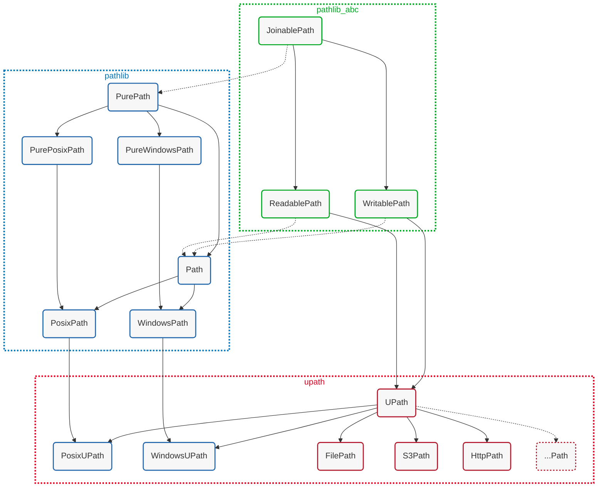

<style>
#upath-logo {
    height: 1.125em;
}
</style>

# Universal Pathlib {: #upath-logo }

**universal-pathlib** (imported as `upath`) bridges Python's [pathlib](https://docs.python.org/3/library/pathlib.html) API with [fsspec](https://filesystem-spec.readthedocs.io/)'s filesystem implementations. It provides a familiar, pathlib-style interface for working with files across local storage, cloud services, and remote systems.

## The Best of Both Worlds

universal-pathlib combines:

- **fsspec's filesystem support**: Access to S3, GCS, Azure, HDFS, HTTP, SFTP, and dozens more backends
- **pathlib's elegant API**: Object-oriented paths, `/` operator, `.exists()`, `.read_text()`, etc.

This means you can write code using the pathlib syntax you already know, and it works seamlessly across any storage system that fsspec supports.

## How UPath and Path Relate via pathlib-abc

`UPath` and `pathlib.Path` are related through the abstract base classes defined in [pathlib-abc](https://github.com/barneygale/pathlib-abc). While they share a common API design, they serve different purposes and have distinct inheritance hierarchies.

### The Class Hierarchy

The following diagram shows how `UPath` implementations relate to `pathlib` classes through the `pathlib_abc` abstract base classes:



**Legend:**

- **Green (pathlib_abc)**: Abstract base classes defining the path interface
- **Blue (pathlib)**: Standard library path classes for local filesystems
- **Red (upath)**: Universal pathlib classes for all filesystems
- Solid lines: Direct inheritance
- Dotted lines: Conceptual relationship (not actual inheritance yet)

### Understanding the Relationships

**pathlib-abc Layer (Green):**

- `JoinablePath` - Basic path manipulation without filesystem access
- `ReadablePath` - Adds read-only filesystem operations
- `WritablePath` - Adds write filesystem operations

**pathlib Layer (Blue):**

- `PurePath` - Pure path manipulation (similar to `JoinablePath` conceptually)
- `Path` - Concrete local filesystem paths (conceptually similar to `ReadablePath` + `WritablePath`)
- Platform-specific: `PosixPath`, `WindowsPath`, etc.

**universal-pathlib Layer (Red):**

- `UPath` - Universal path for any filesystem backend
- Local implementations: `PosixUPath`, `WindowsUPath`, `FilePath`
- Remote implementations: `S3Path`, `HttpPath`, and others

### Key Differences

**Current State (Python 3.9-3.13):**

```python
from pathlib import Path
from upath import UPath
from upath.types import JoinablePath, ReadablePath, WritablePath

# UPath explicitly implements pathlib-abc
path = UPath("s3://bucket/file.txt")
assert isinstance(path, JoinablePath)  # True
assert isinstance(path, ReadablePath)   # True
assert isinstance(path, WritablePath)   # True

# pathlib.Path does NOT (yet) inherit from pathlib-abc
local = Path("/home/user/file.txt")
assert isinstance(local, JoinablePath)  # False
assert isinstance(local, ReadablePath)   # False
assert isinstance(local, WritablePath)   # False
```

**Important Note:** The dotted lines in the diagram represent a conceptual relationship. While `pathlib.Path` doesn't currently inherit from `pathlib_abc` classes, it implements a compatible API. Future Python versions may formalize this relationship.

### Local Path Compatibility

For local filesystem paths, `UPath` provides implementations that are 100% compatible with stdlib `pathlib`:

```python
from pathlib import Path, PosixPath, WindowsPath
from upath import UPath

# Without protocol -> returns platform-specific UPath
local = UPath("/home/user/file.txt")
assert isinstance(local, UPath)           # True
assert isinstance(local, PosixPath)       # True (on Unix systems)
assert isinstance(local, Path)            # True

# With file:// protocol -> returns FilePath (fsspec-based)
file_path = UPath("file:///home/user/file.txt")
assert isinstance(file_path, UPath)       # True
assert not isinstance(file_path, Path)    # False (uses fsspec instead)
```

**PosixUPath and WindowsUPath:**
- Subclass both `UPath` and `pathlib.Path`
- 100% compatible with stdlib pathlib for local paths
- Tested against CPython's pathlib test suite
- Implement `os.PathLike` protocol

**FilePath:**
- Subclass of `UPath` only
- Uses fsspec's `LocalFileSystem` for file access
- Useful for consistent fsspec-based access across all backends
- Implements `os.PathLike` protocol

### Remote and Cloud Paths

For remote filesystems, `UPath` implementations provide the pathlib API backed by fsspec:

```python
from upath import UPath

# S3Path
s3 = UPath("s3://bucket/file.txt")
assert isinstance(s3, UPath)
assert not isinstance(s3, Path)  # Not a local path

# HttpPath
http = UPath("https://example.com/data.json")
assert isinstance(http, UPath)
assert not isinstance(http, Path)  # Not a local path
```

### Why This Design?

This architecture provides several benefits:

1. **Unified API**: Same pathlib interface works across all backends
2. **Type Safety**: pathlib-abc provides formal type hints for path operations
3. **Local Compatibility**: `PosixUPath`/`WindowsUPath` maintain full stdlib compatibility
4. **Flexibility**: Easy to add new filesystem implementations
5. **Future-Proof**: Ready for potential stdlib integration of pathlib-abc

### Writing Filesystem-Agnostic Code

Use pathlib-abc types to write code that works with both `Path` and `UPath`:

```python
from upath.types import ReadablePath, WritablePath

def process_file(input_path: ReadablePath, output_path: WritablePath) -> None:
    """Works with Path, UPath, or any ReadablePath/WritablePath implementation."""
    data = input_path.read_text()
    processed = data.upper()
    output_path.write_text(processed)

# Works with stdlib Path
from pathlib import Path
process_file(Path("input.txt"), Path("output.txt"))

# Works with UPath for cloud storage
from upath import UPath
process_file(
    UPath("s3://input-bucket/data.txt", anon=True),
    UPath("s3://output-bucket/result.txt")
)

# Mix local and remote
process_file(
    UPath("https://example.com/data.txt"),
    Path("/tmp/result.txt")
)
```

## Learn More

- **pathlib concepts**: See [pathlib.md](pathlib.md) for details on the pathlib API
- **fsspec backends**: See [filesystems.md](fsspec.md) for information about available filesystems
- **API reference**: Check the [API documentation](../api/index.md) for complete method details
- **fsspec details**: Visit [fsspec documentation](https://filesystem-spec.readthedocs.io/) for filesystem-specific options
